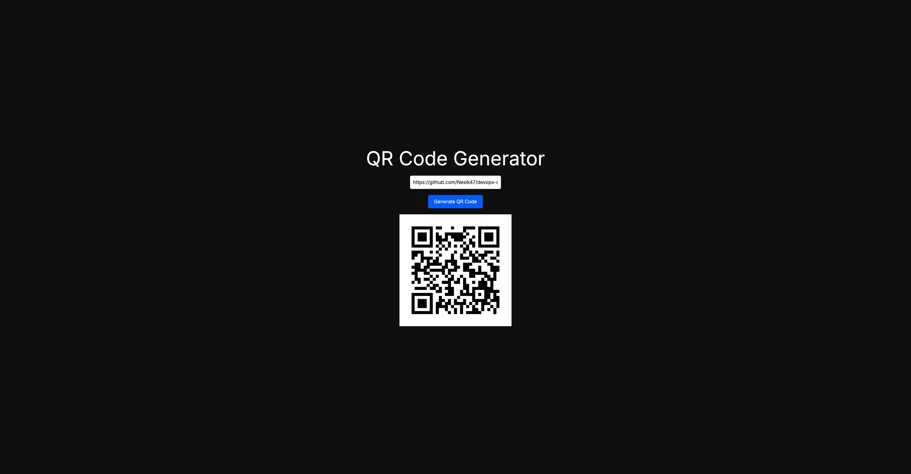
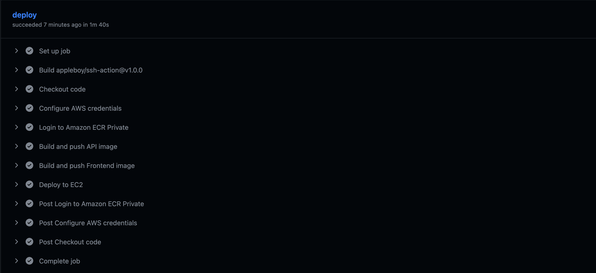
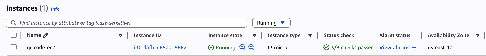
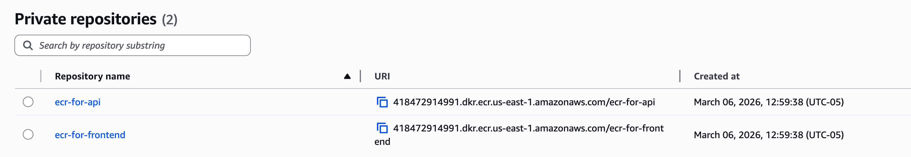
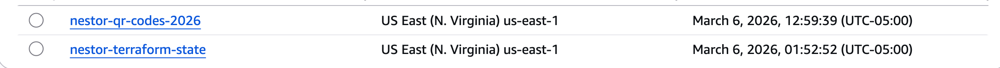

# 🔗 DevOps Capstone Project: QR Code Generator

A full-stack QR Code Generator application deployed on AWS using modern DevOps practices. The project demonstrates end-to-end automation — from infrastructure provisioning to container deployment — using Terraform, Docker, and GitHub Actions CI/CD.

## 🏗️ Architecture

```
                        ┌─────────────────────────────────────────┐
                        │              GitHub Actions              │
                        │                                          │
                        │  Push → Build → Push ECR → Deploy EC2   │
                        └───────────────┬─────────────────────────┘
                                        │ SSH
                    ┌───────────────────▼─────────────────────┐
                    │                  AWS                      │
                    │                                           │
                    │   ┌─────────────────────────────────┐   │
                    │   │            VPC (10.0.0.0/16)    │   │
                    │   │                                  │   │
                    │   │   ┌──────────────────────────┐  │   │
                    │   │   │   Public Subnet           │  │   │
                    │   │   │                           │  │   │
                    │   │   │   ┌───────────────────┐  │  │   │
                    │   │   │   │   EC2 t3.micro    │  │  │   │
                    │   │   │   │                   │  │  │   │
                    │   │   │   │  ┌─────────────┐  │  │  │   │
                    │   │   │   │  │  Frontend   │  │  │  │   │
                    │   │   │   │  │  :3000      │  │  │  │   │
                    │   │   │   │  └─────────────┘  │  │  │   │
                    │   │   │   │  ┌─────────────┐  │  │  │   │
                    │   │   │   │  │  API        │  │  │  │   │
                    │   │   │   │  │  :8000      │  │  │  │   │
                    │   │   │   │  └──────┬──────┘  │  │  │   │
                    │   │   │   └─────────┼─────────┘  │  │   │
                    │   │   └─────────────┼─────────────┘  │   │
                    │   └─────────────────┼─────────────────┘   │
                    │                     │                       │
                    │   ┌─────────────────▼──┐  ┌────────────┐  │
                    │   │   S3 Bucket        │  │  ECR       │  │
                    │   │   (QR Code Store)  │  │  (Images)  │  │
                    │   └────────────────────┘  └────────────┘  │
                    └───────────────────────────────────────────┘
```

**Flow:**
1. User submits URL via frontend (Next.js)
2. Frontend calls API (FastAPI)
3. API generates QR code and stores it in S3
4. S3 URL returned and displayed to user

## 🛠️ Technologies

| Category | Technology |
|----------|-----------|
| Frontend | Next.js 14 |
| Backend | FastAPI (Python) |
| Containerization | Docker, Docker Compose |
| Infrastructure | Terraform |
| Cloud | AWS (EC2, S3, ECR, VPC) |
| CI/CD | GitHub Actions |

## 🔄 CI/CD Pipeline

Every push to `main` branch triggers the following pipeline:

```
git push → GitHub Actions
              │
              ├── 1. Checkout code
              ├── 2. Configure AWS credentials
              ├── 3. Login to Amazon ECR
              ├── 4. Build & Push API image → ECR
              ├── 5. Build & Push Frontend image → ECR
              └── 6. SSH to EC2
                        │
                        ├── Configure AWS CLI
                        ├── Login to ECR
                        ├── Clone repo
                        ├── Create .env file
                        ├── docker compose pull
                        └── docker compose up -d
```

## ☁️ Infrastructure (Terraform)

All infrastructure is defined as code in the `terraform/` directory:

- **VPC** — isolated network with public subnet
- **Internet Gateway + Route Table** — public internet access
- **Security Group** — ports 22, 80, 3000, 8000
- **EC2 t3.micro** — application server (free tier eligible)
- **S3 Bucket** — QR code storage with public access policy
- **ECR** — private Docker image registry (api + frontend)

## 🚀 How to Deploy

### Prerequisites
- AWS CLI configured
- Terraform installed
- GitHub repository with secrets configured

### 1. Provision Infrastructure
```bash
cd terraform
terraform init
terraform apply
```

### 2. Configure GitHub Secrets
```
AWS_ACCESS_KEY_ID
AWS_SECRET_ACCESS_KEY
AWS_REGION
AWS_BUCKET_NAME
ECR_API_URL
ECR_FRONTEND_URL
EC2_PUBLIC_IP
SSH_PRIVATE_KEY
```

### 3. Deploy
Push to `main` branch — GitHub Actions handles the rest.

### 4. Cleanup
```bash
terraform destroy
```

## 📁 Project Structure

```
devops-qr-code/
├── .github/
│   └── workflows/
│       └── deploy.yml          # CI/CD pipeline
├── api/
│   ├── Dockerfile
│   ├── main.py                 # FastAPI application
│   └── requirements.txt
├── front-end-nextjs/
│   ├── Dockerfile
│   └── src/app/page.js         # Next.js frontend
├── terraform/
│   ├── main.tf                 # AWS resources
│   ├── variables.tf
│   ├── outputs.tf
│   ├── providers.tf
│   └── backend.tf              # S3 remote state
└── docker-compose.yml
```

## 📸 Screenshots

### Application


### CI/CD Pipeline


### AWS Infrastructure


